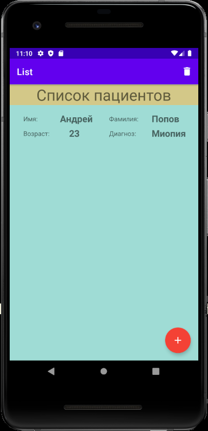
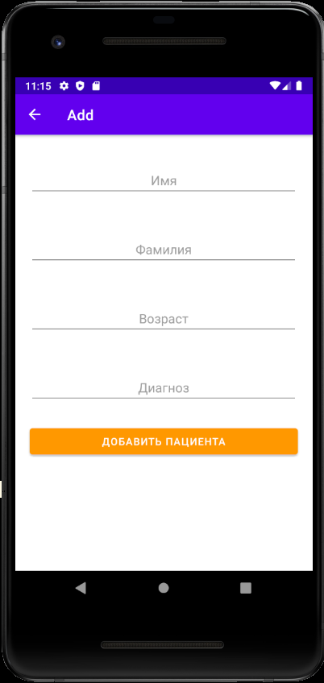

  <h2>DataBaseRoom
    

    Здравствуйте. Это учебное приложение по базам данных с использование Room и корутин. Приложение делал по аналогии ютуб- канала https://www.youtube.com/watch?v=lwAvI3WDXBY. Однако,  добавил в это приложение что-то своё.
    

    

     

     

